# Ghost Media Manager

> The missing media library for Ghost CMS

[](https://github.com/sebmuc99/Ghost-Media-Manager/actions/workflows/docker-build.yml)
[](https://github.com/sebmuc99/Ghost-Media-Manager/actions/workflows/lint.yml)
[](LICENSE)
[](https://github.com/sebmuc99/Ghost-Media-Manager/pkgs/container/ghost-media-manager)
[](https://nodejs.org)

## Screenshots

> Click any screenshot to view full size.

<table>
<tr>
  <td align="center"><a href="image.png">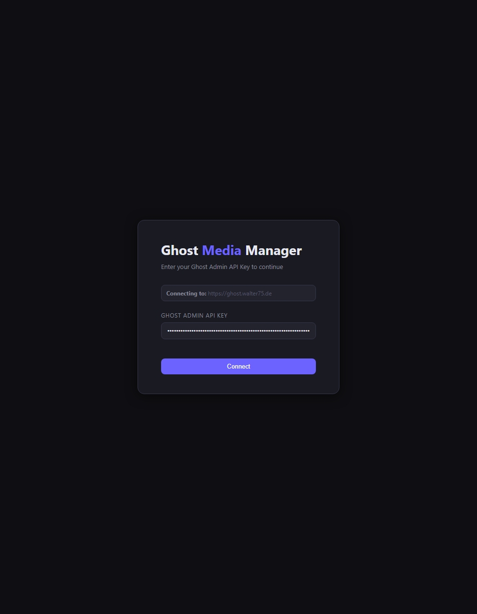</a><br/><sub><b>Login Screen</b></sub></td>
  <td align="center"><a href="image-1.png">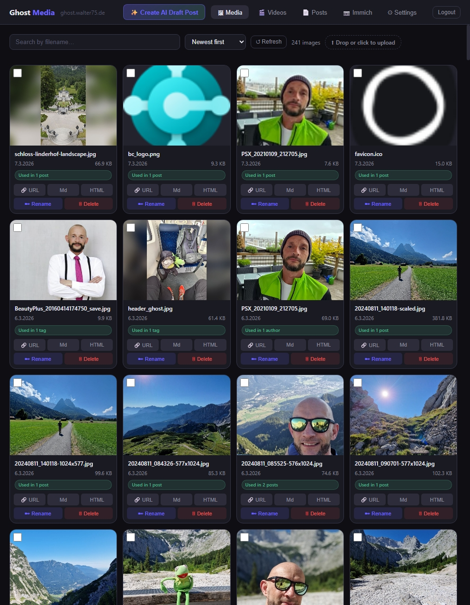</a><br/><sub><b>Media Library</b></sub></td>
</tr>
<tr>
  <td align="center"><a href="image-10.png">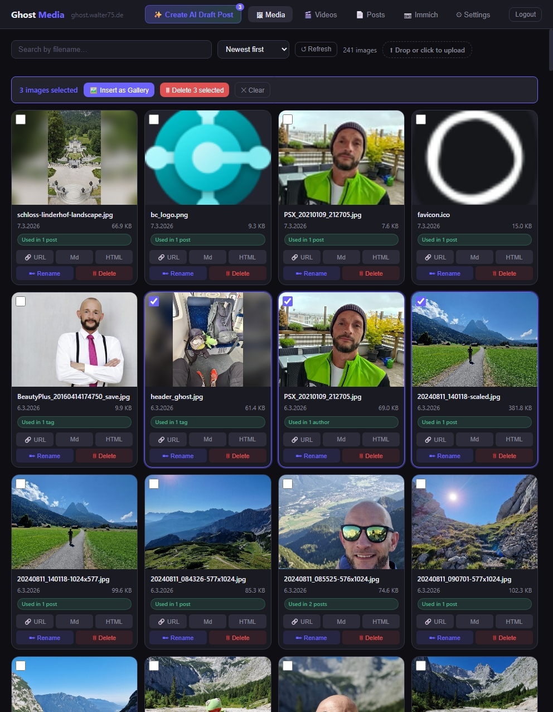</a><br/><sub><b>Bulk Selection</b></sub></td>
  <td align="center"><a href="image-2.png">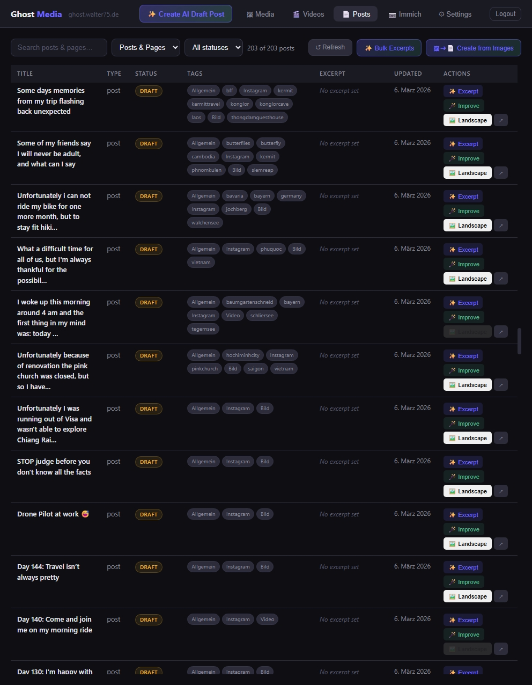</a><br/><sub><b>Post Management</b></sub></td>
</tr>
<tr>
  <td align="center"><a href="image-4.png">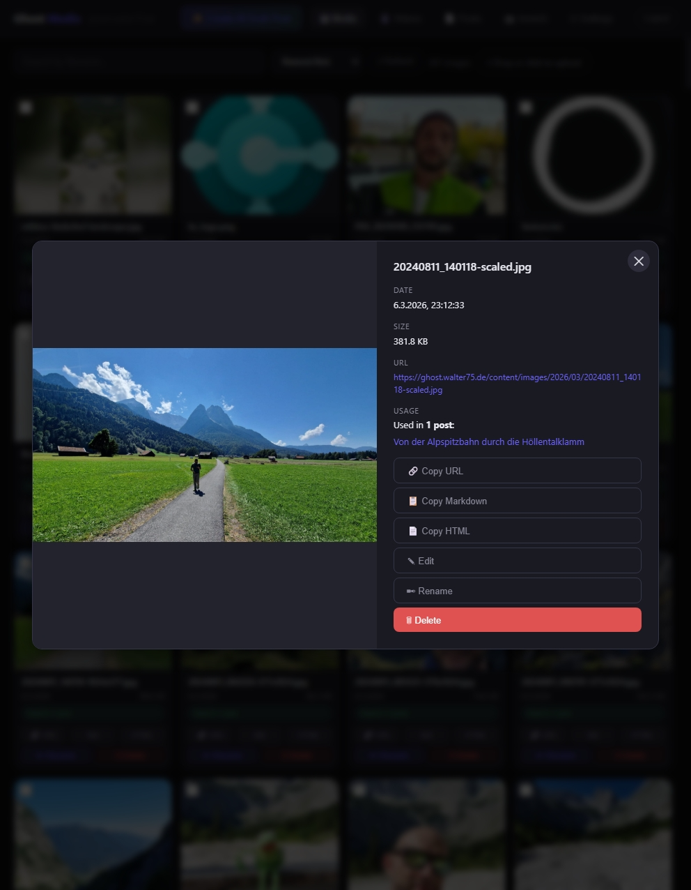</a><br/><sub><b>Image Editor</b></sub></td>
  <td align="center"><a href="image-3.png">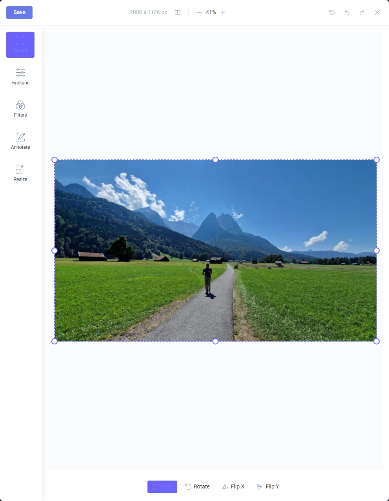</a><br/><sub><b>Image Editor — Annotate</b></sub></td>
</tr>
<tr>
  <td align="center"><a href="image-5.png">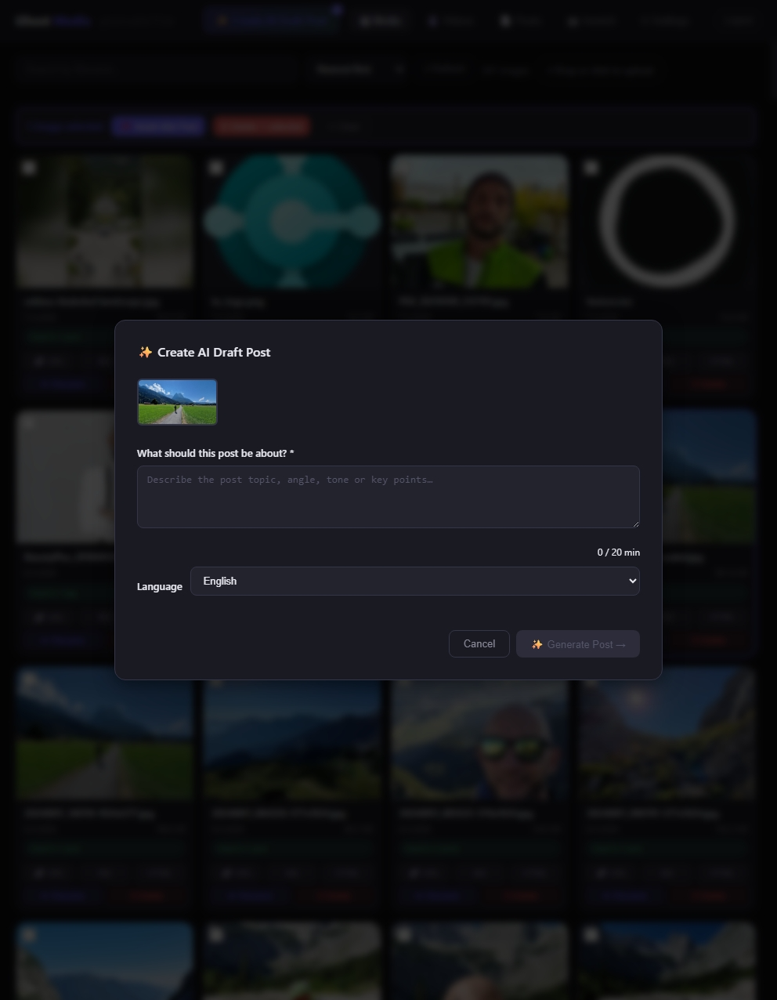</a><br/><sub><b>AI — Create Post from Image</b></sub></td>
  <td align="center"><a href="image-6.png">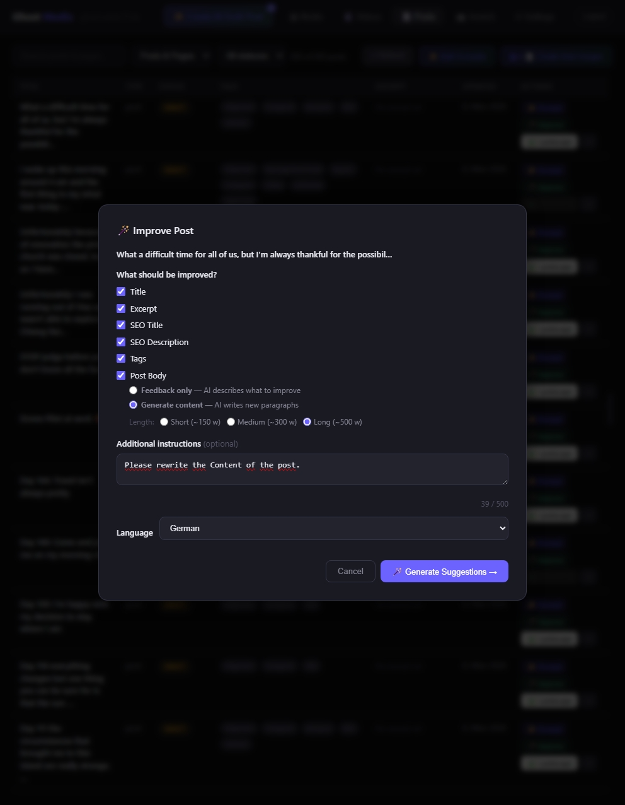</a><br/><sub><b>AI — Improve Post</b></sub></td>
</tr>
<tr>
  <td align="center"><a href="image-7.png">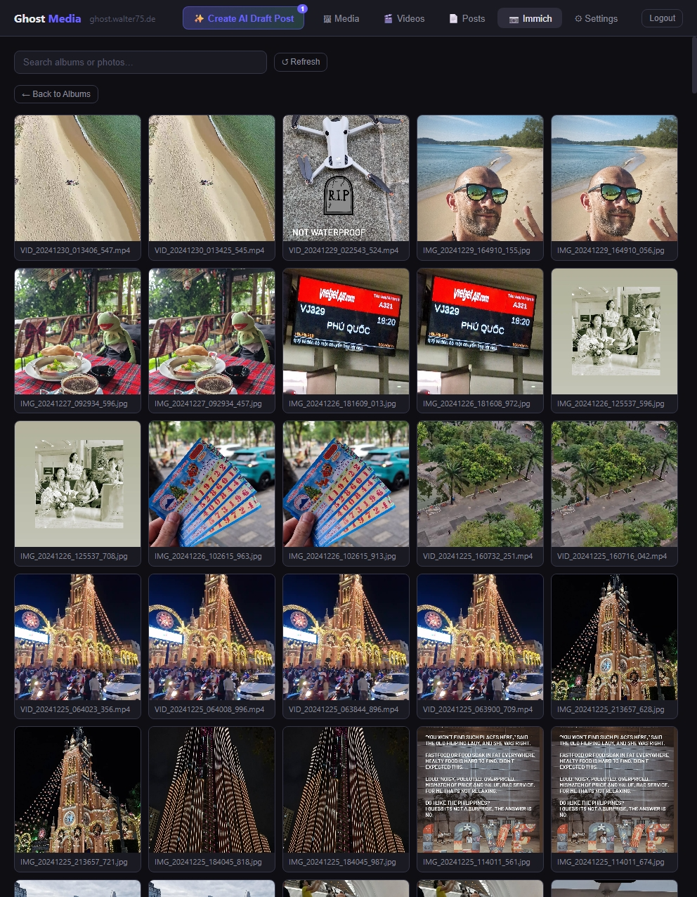</a><br/><sub><b>Immich Gallery</b></sub></td>
  <td align="center"><a href="image-8.png">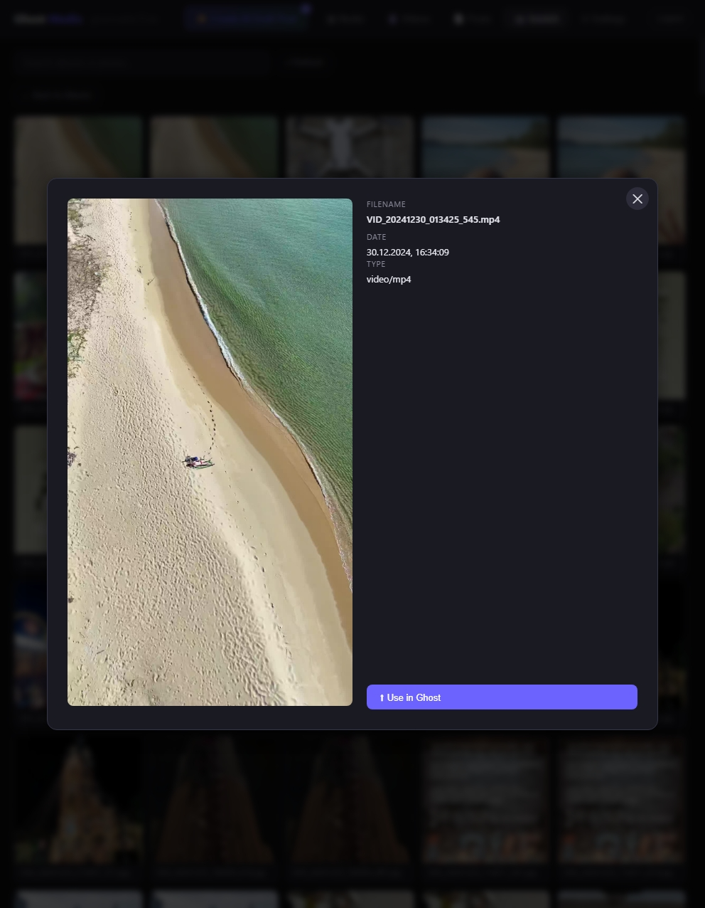</a><br/><sub><b>Immich — Use in Ghost</b></sub></td>
</tr>
<tr>
  <td align="center"><a href="image-9.png">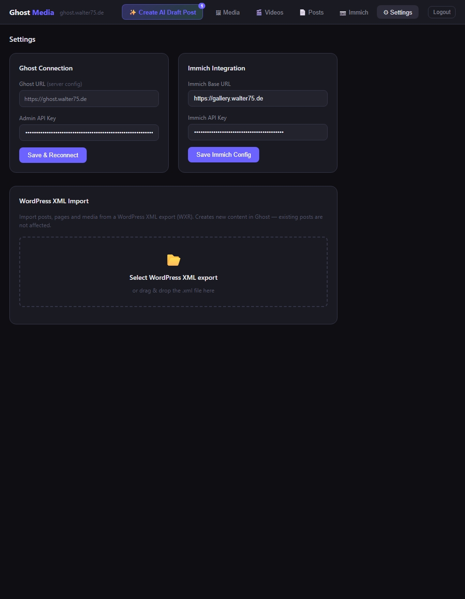</a><br/><sub><b>Settings</b></sub></td>
  <td></td>
</tr>
</table>

---

Ghost has no built-in media library. **Ghost Media Manager** fills this gap
with a self-hosted web app that gives you full control over all Ghost media
files — images, videos, and file attachments.

Runs as a single Docker container. Works great with **Portainer**, Synology,
Unraid, or any Docker host.

---

## Features

### Media Management
- Image browser with search, sort, and usage tracking
- Video management with thumbnail preview and upload
- File attachment management with upload
- Bulk delete across all tabs with progress tracking
- Image editor (crop, rotate, flip, annotate via Filerobot)
- One-click Markdown / HTML copy for any file

### Content & AI
- Post management — browse all posts with tag and excerpt status
- Make Landscape — convert portrait feature images to 16:9
- AI-powered excerpt generation (Anthropic Claude)
- AI post improvement — excerpt, tags, SEO title, body feedback
- AI post body rewrite — generate and insert new paragraphs
- Create posts from mixed media: images, videos, PDFs (vision AI)
- AI tags are always constrained to your existing Ghost tags

### Import & Migration
- WordPress XML import with full Gutenberg block conversion
- Downloads and re-uploads all media to Ghost automatically
- Preserves original publish dates, tags, slugs

### Integrations
- Immich photo library — browse and import photos directly
- Ghost Admin API v5 — no Ghost plugin required

---

## Quick Start

### Docker Compose (recommended)

```yaml
services:
  ghost-media-manager:
    image: ghcr.io/sebmuc99/ghost-media-manager:latest
    container_name: ghost-media-manager
    restart: unless-stopped
    ports:
      - "3334:3334"
    environment:
      - GHOST_URL=https://your-ghost.com
      # Required when accessed via a reverse proxy / public domain:
      # - PUBLIC_URL=https://your-ghost-manager.example.com
      # Optional: AI features
      # - ANTHROPIC_API_KEY=sk-ant-...
      # Optional: Immich integration
      # - IMMICH_URL=https://your-immich.com
      # - IMMICH_API_KEY=your-immich-key
      # Optional: filesystem paths (add when mounting volumes below)
      # - GHOST_MEDIA_PATH=/ghost-images
      # - GHOST_MEDIA_VIDEO_PATH=/ghost-media
      # - GHOST_MEDIA_FILES_PATH=/ghost-files
    # Optional: mount Ghost content directories for full functionality
    # volumes:
    #   - /path/to/ghost/content/images:/ghost-images
    #   - /path/to/ghost/content/media:/ghost-media
    #   - /path/to/ghost/content/files:/ghost-files
```

```bash
docker compose up -d
```

Open **http://your-server:3334**, enter your Ghost URL and Admin API key in the login screen.

### Portainer

1. **Stacks → Add stack**
2. Paste the `docker-compose.yml` above
3. Set environment variables or edit inline
4. Deploy

The container includes a health check — Portainer will show the green
"healthy" status automatically.

### Docker Run

```bash
docker run -d \
  --name ghost-media-manager \
  -p 3334:3334 \
  -e GHOST_URL=https://your-ghost.com \
  --restart unless-stopped \
  ghcr.io/sebmuc99/ghost-media-manager:latest
```

---

## Getting your Ghost Admin API Key

1. Open **Ghost Admin → Settings → Integrations**
2. Click **Add custom integration**
3. Name it `Ghost Media Manager`
4. Copy the **Admin API Key** (format: `id:secret`)

---

## Configuration

All configuration is done via environment variables.
See [CONFIGURATION.md](CONFIGURATION.md) for the full reference.

### Required

| Variable | Description |
|----------|-------------|
| `GHOST_URL` | Your Ghost instance URL (no trailing slash) |

> **Authentication:** The Ghost Admin API key is entered in the browser login screen — not configured as an environment variable. See [Getting your Ghost Admin API Key](#getting-your-ghost-admin-api-key) below.

### Filesystem Access (optional, recommended)

Mount your Ghost content directories to enable rename, delete, image
editor, and usage badges. Without these, the app works in API-only mode
(upload and browse).

```yaml
volumes:
  - /path/to/ghost/content/images:/ghost-images
  - /path/to/ghost/content/media:/ghost-media
  - /path/to/ghost/content/files:/ghost-files
environment:
  - GHOST_MEDIA_PATH=/ghost-images
  - GHOST_MEDIA_VIDEO_PATH=/ghost-media
  - GHOST_MEDIA_FILES_PATH=/ghost-files
```

### AI Features (optional)

Requires an [Anthropic API key](https://console.anthropic.com).
Estimated costs: ~$0.06 for 50 excerpts, ~$0.05 per image post.

```yaml
environment:
  - ANTHROPIC_API_KEY=sk-ant-...
```

### Immich Integration (optional)

```yaml
environment:
  - IMMICH_URL=https://your-immich.com
  - IMMICH_API_KEY=your-immich-key
```

---

## Architecture

See [ARCHITECTURE.md](ARCHITECTURE.md) for technical
documentation including the full route map and module structure.

## Contributing

See [CONTRIBUTING.md](CONTRIBUTING.md).

## Changelog

See [CHANGELOG.md](CHANGELOG.md).

## License

MIT — see [LICENSE](LICENSE).
